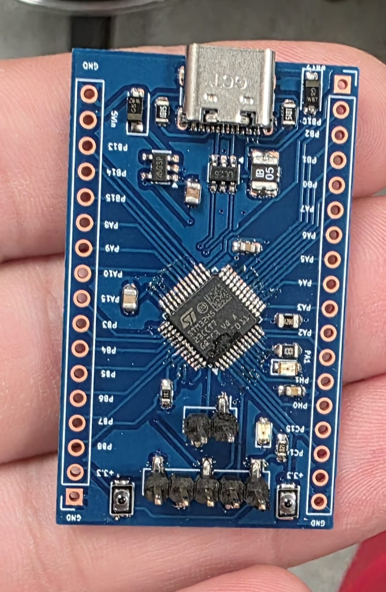
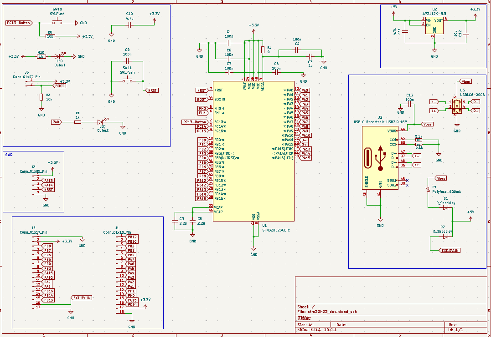
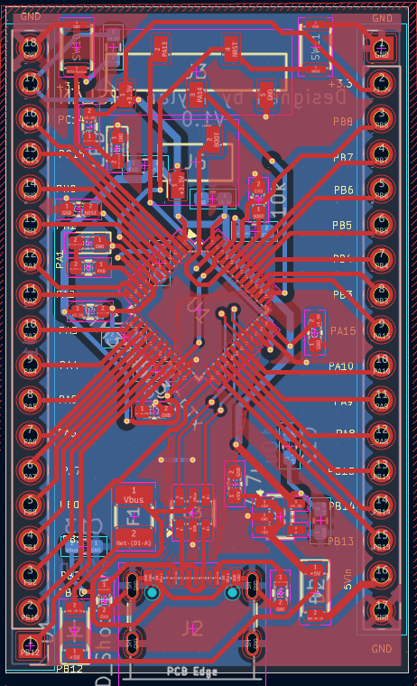

# STM32H523CE Compact Development Board

A compact, breadboard-oriented development board built around the **STM32H523CE** (Arm Cortex-M33). The board was designed in **KiCad 10** to expose the MCU's useful I/O while keeping the essentials onboard: USB-C, SWD, 3.3 V regulation, BOOT/RESET control, status/user LEDs, a user button, and an alternate 5 V input.

<p align="center">
  
</p>

<p align="center"><em>Assembled V1 prototype.</em></p>

> **Hardware revision:** V1.0  
> **Board size:** 29.07 mm × 48.17 mm  
> **PCB:** 2-layer, 1.6 mm  
> **Design status:** Assembled V1 prototype. Verify the current revision and component choices before production or reuse.

## Why this board exists

The goal was to make a small STM32H5 platform that is easier to embed in custom electronics than a full-size evaluation board while still retaining the interfaces needed for normal firmware development and hardware debugging.

It is intended for:

- STM32H5 firmware development
- Breadboard and bench prototyping
- Embedded-control projects
- Robotics and custom electronics
- USB device experiments
- Reusable MCU-controller modules inside larger projects

## Main features

- **STM32H523CETx**, LQFP-48
  - Arm Cortex-M33
  - Up to 250 MHz
  - 512 KB Flash
  - 272 KB SRAM
- **USB-C** connector for 5 V input and native USB Full-Speed data
- **USB ESD protection** using USBLC6-2SC6
- **5.1 kΩ Type-C CC pull-downs** for USB device/sink operation
- **3.3 V regulation** using AP2112K-3.3
- **500 mA resettable fuse** on the USB power input
- **Schottky diode power OR-ing** between USB 5 V and external 5 V input
- **5-pin SWD header**
- **RESET push button**
- **BOOT0 jumper/header** with 10 kΩ pull-down
- **User push button** on PC13, active-low
- **User LED** on PA0
- **3.3 V power LED**
- Dual **2.54 mm GPIO headers**
- VDDA filtering and dedicated VCAP capacitors
- HSE/LSE oscillator pins remain available on the headers; no external crystals are fitted onboard

## Hardware design

### Schematic

The full board schematic is shown below. It includes the STM32H523CE core, USB-C interface and ESD protection, 5 V input selection, 3.3 V regulator, SWD, BOOT0, reset, user button, LEDs, decoupling, and GPIO headers.

[](Media/Schematic.png)

_Click the schematic to open the full-resolution image._

### PCB layout

The V1 board is a compact two-layer layout with the MCU centered between the two GPIO header rows and the USB-C/power circuitry at the top of the board.

<p align="center">
  <a href="Media/Layout.png">
    
  </a>
</p>

_Click the PCB layout to open the full-resolution image._

## Board overview

The design intentionally keeps the MCU support circuitry minimal. USB D− and D+ connect to **PA11** and **PA12** through the USB ESD protector. The board can be powered from USB-C or from the external 5 V header input. Both sources feed the main 5 V rail through Schottky diodes before the AP2112K-3.3 regulator.

The MCU's two VCAP pins are connected together and each is supported by a 2.2 µF capacitor, following the STM32H5 hardware-development guidance.

### Power path

```text
USB-C VBUS
   │
  F1 500 mA polyfuse
   │
  D1 Schottky ───────┐
                     ├── +5V ── AP2112K-3.3 ── +3.3V
EXT_5V_IN ─ D2 ──────┘
```

The USB branch is protected by F1. The external 5 V input is diode-isolated but does **not** pass through the USB polyfuse.

## Pinout

### J1 — left GPIO header

Physical order below is **bottom to top when viewing the PCB from the component/silkscreen side**, matching J1 pin numbering.

| Pin | Signal |
|---:|---|
| 1 | PB12 |
| 2 | PB10 |
| 3 | PB2 |
| 4 | PB1 |
| 5 | PB0 |
| 6 | PA7 |
| 7 | PA6 |
| 8 | PA5 |
| 9 | PA4 |
| 10 | PA3 |
| 11 | PA2 |
| 12 | PA1 |
| 13 | PH1 / OSC_OUT |
| 14 | PH0 / OSC_IN |
| 15 | PC15 / OSC32_OUT |
| 16 | PC14 / OSC32_IN |
| 17 | +3.3 V |
| 18 | GND |

### J5 — right GPIO/power header

Physical order below is **top to bottom when viewing the PCB from the component/silkscreen side**, matching J5 pin numbering.

| Pin | Signal |
|---:|---|
| 1 | GND |
| 2 | +3.3 V |
| 3 | PB8 |
| 4 | PB7 |
| 5 | PB6 |
| 6 | PB5 |
| 7 | PB4 |
| 8 | PB3 |
| 9 | PA15 |
| 10 | PA10 |
| 11 | PA9 |
| 12 | PA8 |
| 13 | PB15 |
| 14 | PB14 |
| 15 | PB13 |
| 16 | EXT_5V_IN |
| 17 | GND |

### J3 — SWD

| Pin | Signal | Purpose |
|---:|---|---|
| 1 | +3.3 V | Target reference voltage |
| 2 | PA13 | SWDIO |
| 3 | PA14 | SWCLK |
| 4 | NRST | Reset |
| 5 | GND | Ground |

### J6 — BOOT0

| Pin | Signal |
|---:|---|
| 1 | +3.3 V |
| 2 | BOOT0 |

BOOT0 is normally held low by a **10 kΩ pull-down**. The header allows BOOT0 to be driven high when required. Actual boot behavior also depends on the STM32 option-byte configuration.

## Onboard controls and indicators

| Function | MCU pin | Electrical behavior |
|---|---|---|
| User button | PC13 | Active-low; 10 kΩ pull-up to 3.3 V |
| User LED | PA0 | Active-high through 1 kΩ resistor |
| Power LED | — | Connected to 3.3 V through 1 kΩ resistor |
| Reset button | NRST | Pulls NRST low |
| BOOT0 | BOOT0 | 10 kΩ pull-down; J6 can pull high |

## USB

The USB-C receptacle is configured as a **USB device/sink port** using 5.1 kΩ pull-down resistors on CC1 and CC2.

| USB signal | MCU pin |
|---|---|
| D− | PA11 |
| D+ | PA12 |
| VBUS | USB power input path |
| Shield | GND |

A **USBLC6-2SC6** protects the D+/D− data path against ESD.

## Clocking

No external HSE or LSE crystal is fitted on V1.0. This keeps the board compact and leaves the oscillator pins usable from the headers:

- PH0 / PH1 — HSE oscillator pins
- PC14 / PC15 — LSE oscillator pins

Firmware can use the STM32's internal clock sources where suitable. If a project requires an external crystal or external clock, design and component values should follow the STM32H523 datasheet and STM32H5 hardware-development guidance.

## Power notes

- Normal logic rail: **3.3 V**
- Intended board input: **5 V** from USB-C or EXT_5V_IN
- Do not apply 5 V to GPIO pins.
- The USB VBUS path includes a 500 mA resettable fuse.
- EXT_5V_IN is diode-isolated but is not protected by F1.
- When powering from an external source, verify polarity and voltage before connecting.
- The 3.3 V regulator is an AP2112K-3.3; total available current depends on input voltage, thermal conditions, PCB copper, and the complete system load.

## Getting started

### 1. Inspect the assembled board

Before first power-up:

1. Check for solder bridges around the LQFP-48 MCU and USB-C connector.
2. Confirm there is no short between +3.3 V and GND.
3. Confirm polarity/orientation of D1, D2, LEDs, U2, and U3.
4. Verify that BOOT0 is not accidentally shorted to +3.3 V.

### 2. First power-up

Power the board from a current-limited 5 V supply or USB-C and verify:

- +5 V rail is present after the source-selection diode.
- +3.3 V rail is approximately 3.3 V.
- Power LED turns on.
- No component overheats.

### 3. Connect an ST-LINK

Connect the programmer/debugger to J3:

```text
J3.1  3V3   -> VTref / 3.3 V reference
J3.2  PA13  -> SWDIO
J3.3  PA14  -> SWCLK
J3.4  NRST  -> NRST
J3.5  GND   -> GND
```

Use **STM32CubeProgrammer** or **STM32CubeIDE** with the target device set to **STM32H523CETx**.

### 4. Minimal firmware test

A useful first bring-up test is:

1. Configure PA0 as a push-pull GPIO output.
2. Toggle PA0 at a visible rate.
3. Verify the user LED blinks.
4. Configure PC13 as a digital input with the onboard pull-up behavior in mind.
5. Verify that pressing the user button reads a logic low.

Once SWD, the LED, and the button work, continue with USB and the required peripherals.

## Recommended bring-up checklist

- [ ] 5 V input rail verified
- [ ] 3.3 V regulator output verified
- [ ] Power LED working
- [ ] SWD connection detected
- [ ] MCU can be erased/programmed
- [ ] User LED on PA0 tested
- [ ] User button on PC13 tested
- [ ] NRST button tested
- [ ] BOOT0 behavior tested if required
- [ ] USB device enumerates
- [ ] Header GPIO continuity checked

## Schematic / PCB design notes

### MCU power

- VDD and VBAT are supplied from +3.3 V.
- VDDA is connected to +3.3 V through **R1 = 0 Ω** and locally decoupled.
- VSSA is tied to GND.
- Both VCAP pins share the VCAP rail and each has a **2.2 µF** capacitor.
- Local 100 nF decoupling capacitors are distributed around the MCU supply pins.

### Reset

NRST includes:

- Reset push button to GND
- 100 nF capacitor to GND
- SWD header connection

### BOOT0

BOOT0 includes:

- 10 kΩ pull-down to GND
- 2-pin header to allow BOOT0 to be pulled to +3.3 V

## Hardware files

The complete hardware package currently published with this repository is:

- [`Hardware/stm32h23_dev.zip`](Hardware/stm32h23_dev.zip) — KiCad project files and V1 Gerber/drill files.

The archive contains the editable KiCad schematic and PCB source as well as the fabrication outputs used for V1. This makes it possible to inspect, modify, and regenerate the design rather than relying only on screenshots.

### Component reproducibility

Several parts in the current KiCad design are specified by electrical value/footprint rather than a frozen manufacturer part number. Before ordering a new batch, verify the exact component you intend to use for:

- D1 / D2 Schottky diodes
- F1 500 mA resettable fuse
- Indicator/user LEDs
- Push buttons
- Pin headers
- Exact USB-C connector variant

Footprint compatibility alone does not guarantee that a substitute is electrically or mechanically equivalent.

## Manufacturing

The V1 Gerber and drill files are included inside [`Hardware/stm32h23_dev.zip`](Hardware/stm32h23_dev.zip), under the `gerbers/V1/` directory.

Current PCB parameters taken from the KiCad design:

| Parameter | Value |
|---|---|
| Layers | 2 |
| Board thickness | 1.6 mm |
| Board dimensions | 29.07 mm × 48.17 mm |
| Copper layers | F.Cu, B.Cu |
| Through-hole drill files | Included |
| NPTH drill file | Included |
| Solder mask | Front + back |
| Silkscreen | Front + back |

Before ordering a new revision, regenerate fabrication files from the exact tagged KiCad source rather than assuming an old Gerber ZIP matches the latest PCB file.

## Repository structure

```text
.
├── README.md
├── Hardware/
│   └── stm32h23_dev.zip
└── Media/
    ├── PCB-Image.jpeg
    ├── Layout.png
    └── Schematic.png
```

The README intentionally references only the media currently present in the repository. There are no placeholder renders, extra board photos, or demo videos.

### Recommended cleanup for the hardware archive

For a cleaner public release, the next hardware ZIP should contain the final KiCad project and fabrication files but omit editor-generated data such as `.history/`, `*-backups/`, `*.lck`, and other temporary files. This keeps the downloadable hardware package smaller and avoids publishing internal revision clutter.

## Revisions

| Revision | Status | Notes |
|---|---|---|
| V1.0 | Prototype | Initial STM32H523CE development-board design |

For future revisions, create a Git tag/release and keep the matching schematic, PCB, BOM, and manufacturing package together.

## Documentation references

Useful ST documents for this board:

- **DS14540** — STM32H523xx datasheet
- **RM0481** — STM32H523/533 and related STM32H5 reference manual
- **AN5711** — Getting started with STM32H5 MCU hardware development
- **AN2606** — STM32 system-memory boot mode

Always use the latest revision of the official ST documentation when modifying the hardware.

## Known limitations / design choices

- No onboard ST-LINK; an external SWD programmer/debugger is required.
- No HSE crystal fitted.
- No 32.768 kHz LSE crystal fitted.
- USB-C is wired for USB device/sink use, not USB-C source/host power delivery.
- PA11 and PA12 are dedicated to the onboard USB connection and are not present on the main GPIO headers.
- PA13 and PA14 are reserved for SWD on J3 and are not present on the main GPIO headers.
- PC13 is used by the onboard user button and is not present on the main GPIO headers.
- PA0 is exposed only through the onboard user LED circuit in V1.0 rather than the main headers.
- Exact MPNs for several generic passives/mechanical components still need to be frozen for a fully order-ready BOM.

## Contributing

If you build or modify the board:

1. State the hardware revision you tested.
2. Describe any component substitutions.
3. Include measurements or test results where possible.
4. Keep schematic, PCB, BOM, and Gerbers synchronized.
5. Open an issue before making incompatible pinout changes.

## License

For an open-hardware release, **CERN-OHL-P-2.0** is a good fit for the PCB/schematic design. If firmware is added later, it can be licensed separately (for example under MIT).

Add the chosen license text as `LICENSE` before publishing the repository.

## Author

Designed by **Taylan ARSLAN**.
